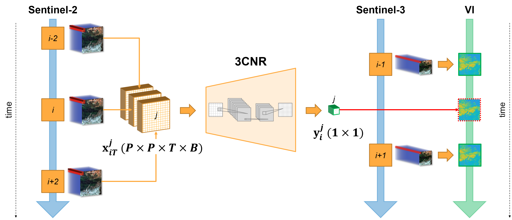
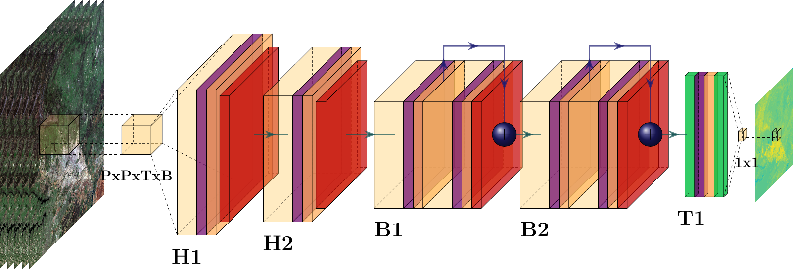

# Time-Resolved Sentinel-3 Vegetation Indices via Inter-Sensor 3D Convolutional Regression Networks

[Ruben Fernandez-Beltran](https://scholar.google.es/citations?user=pdzJmcQAAAAJ&hl=es), [Damian Iba{\~n}ez](https://ieeexplore.ieee.org/author/37088513937), [Jian Kang](https://github.com/jiankang1991), [Filiberto Pla](https://scholar.google.es/citations?user=mSSPcAMAAAAJ&hl=es)
---

This repo contains the codes for the RS paper: [Time-Resolved Sentinel-3 Vegetation Indices via Inter-Sensor 3D Convolutional Regression Networks](https://ieeexplore.ieee.org/abstract/document/9528501). Sentinel missions provide widespread opportunities of exploiting inter-sensor synergies to improve the operational monitoring of terrestrial photosynthetic activity and canopy structural variations using vegetation indices (VI). In this context, continuous and consistent temporal data are logically required to rapidly detect vegetation changes across sensors. Nonetheless, the existing temporal limitations inherent to satellite orbits, cloud occlusions, data degradation and many other factors may severely constrain the availability of data involving multiple satellites. In response, this paper proposes a novel deep 3D convolutional regression network (3CRN) for temporally enhancing Sentinel-3 VI by taking advantage of inter-sensor Sentinel-2 observations. Unlike existing regression and deep learning-based methods, the proposed approach allows convolutional kernels to slide across the temporal dimension in order to exploit not only the higher spatial resolution of the Sentinel-2 instrument but also its own temporal evolution to better estimate time-resolved VI in Sentinel-3. To validate the proposed approach, we built a database made of multiple day-synchronized Sentinel-2 and Sentinel-3 operational products from a study area in Extremadura (Spain). The conducted experimental comparison, including multiple state-of-the-art regression and deep learning models, shows the statistically significant advantages of the presented framework..






## Usage

`./codes/model_3CRN.py` is the proposed 3CRN model.

<!-- `./codes/RUN_3dcnn.m` is a sample of the main script. -->


## Citation

```
@article{fernandez2021time,
  title={Time-Resolved Sentinel-3 Vegetation Indices Via Inter-Sensor 3-D Convolutional Regression Networks},
  author={Fernandez-Beltran, Ruben and Iba{\~n}ez, Damian and Kang, Jian and Pla, Filiberto},
  journal={IEEE Geoscience and Remote Sensing Letters},
  volume={19},
  pages={1-5},
  year={2022},
  publisher={IEEE},
  doi={10.1109/LGRS.2021.3108856}
}
```


## References

[1] E. Aptoula and S. Ariman, "Chlorophyll-a Retrieval From Sentinel-2 Images Using Convolutional Neural Network Regression," in IEEE Geoscience and Remote Sensing Letters, vol. 19, pp. 1-5, 2022, Art no. 6002605, doi: 10.1109/LGRS.2021.3070437.

[2] W. Yu et al., "Spatial–Temporal Prediction of Vegetation Index With Deep Recurrent Neural Networks," in IEEE Geoscience and Remote Sensing Letters, vol. 19, pp. 1-5, 2022, Art no. 2501105, doi: 10.1109/LGRS.2021.3064814.
